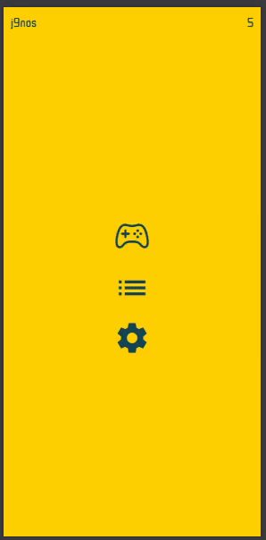

  

# 🎯 Mandarin Tone Darts

A gamified approach to mastering Mandarin Chinese tones.  
Practice recognizing the four tones of Mandarin in a fast-paced, interactive environment designed to build reflexive tone recognition.

---

## 🕹️ Gameplay Overview

  

Players are presented with Mandarin syllables and must quickly identify the correct tone. The goal is to train instant recognition through repetition and speed, turning tone learning into an arcade-style experience.

---

## 🏮 Mandarin Tones Explained

Mandarin Chinese has four primary tones. The same syllable can have different meanings depending on tone:

- **1st Tone (ˉ)** — High and level  
  Stable pitch, like holding a single high note.

- **2nd Tone (´)** — Rising  
  Starts mid and rises upward, similar to asking a question in English.

- **3rd Tone (ˇ)** — Dipping  
  Falls then rises again; the most dynamic and complex tone.

- **4th Tone (ˋ)** — Falling  
  Sharp and decisive drop in pitch.

---

## 🚀 Quick Start

The entire project is fully containerized using Docker and Docker Compose.

### 🧰 Prerequisites

Make sure you have installed:

- [Docker](https://www.docker.com/products/docker-desktop/)
- [Docker Compose](https://docs.docker.com/compose/)

